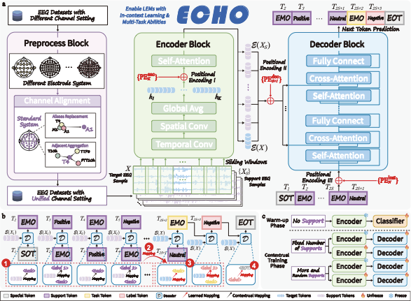

English | [中文](README_CN.md)

# The official repository of "ECHO: Toward Contextual Seq2seq Paradigms in Large EEG Models" [](https://arxiv.org/abs/2509.22556)

This repository contains the official implementation of ECHO. The released pipeline is split into two stages:
- `FAST/`: EEG encoder warm-up
- `EEG2Text/`: EEG-to-text contextual pretraining

## News
- Mar 2026: ECHO is accepted to [ICLR 2026](https://openreview.net/forum?id=ClLQ6cLkoR). 🎉
## Scope Of This Release

- raw-data preprocessing to standardized `.h5`
- FAST encoder pretraining
- ECHO/ECHO-long EEG-to-text pretraining

## Minimal Entrypoints
For the main workflow, use these three shell scripts:
- `FAST/EEG_Dataset/preprocess_selected.sh`
- `FAST/train_multisource_split.sh`
- `EEG2Text/multisource_icl.sh`

<p align="center">
  
  <br>
  <em>Main figure of the ECHO framework. View the high-resolution PDF <a href="images/main.pdf">here</a>.</em>
  
</p>

## Setup
We recommend two Conda environments.

```bash
conda create -n echo-encoder python=3.12
conda create -n echo-decoder python=3.12

conda activate echo-encoder
pip install -r requirements_encoder.txt

conda activate echo-decoder
pip install -r requirements_decoder.txt
```

## Paths
```bash
export FAST_EEG_SOURCE_ROOT=/path/to/raw-datasets
export ECHO_DATASET_ROOT=/path/to/EEG_Standardized_Group
export FAST_EEG_OUTPUT="$ECHO_DATASET_ROOT"
```

- `FAST_EEG_SOURCE_ROOT`: raw downloaded datasets
- `ECHO_DATASET_ROOT`: standardized `.h5` files used by training
- `FAST_EEG_OUTPUT`: preprocessing output directory

## Dataset Preparation
Preprocessing scripts live under `FAST/EEG_Dataset/`.

Main pretraining profile:

```bash
cd FAST/EEG_Dataset
FAST_EEG_SOURCE_ROOT=/path/to/raw-datasets \
ECHO_DATASET_ROOT=/path/to/EEG_Standardized_Group \
FAST_EEG_OUTPUT=/path/to/EEG_Standardized_Group \
PREPROCESS_PROFILE=main \
bash preprocess_selected.sh
```

Optional SLEEP tasks(ISRUC) profile:

```bash
cd FAST/EEG_Dataset
FAST_EEG_SOURCE_ROOT=/path/to/raw-datasets \
ECHO_DATASET_ROOT=/path/to/EEG_Standardized_Group \
FAST_EEG_OUTPUT=/path/to/EEG_Standardized_Group \
PREPROCESS_PROFILE=isruc \
bash preprocess_selected.sh
```

You can also pass dataset scripts manually:

```bash
cd FAST/EEG_Dataset
FAST_EEG_SOURCE_ROOT=/path/to/raw-datasets \
FAST_EEG_OUTPUT=/path/to/EEG_Standardized_Group \
bash preprocess_selected.sh MI_10_HeBin2021.py EMO_03_SEED_V.py
```

`main` covers:
- MI: `MI_01_KoreaU`, `MI_03_Shin2017A`, `MI_04_BCI_IV_2a`, `MI_05_Weibo2014`, `MI_06_Schirrmeister2017`, `MI_07_Cho2017`, `MI_09_Track4_Upper_limb`, `MI_10_HeBin2021_LR`, `MI_10_HeBin2021_UD`, `MI_11_HeBin2024_LR`, `MI_11_HeBin2024_UD`, `MI_12_PhysioNet`
- EMO: `EMO_02_SEED_IV`, `EMO_03_SEED_V`, `EMO_04_SEED`, `EMO_05_THU-EP`

`isruc` covers:
- sleep: `SLEEP_05_isruc_S1`, `SLEEP_05_isruc_S3`

## Step 1: FAST Encoder Warm-up
Run FAST pretraining with the same standardized dataset root.

Main profile:

```bash
cd FAST
ECHO_DATASET_ROOT=/path/to/EEG_Standardized_Group \
PRETRAIN_PROFILE=main \
bash train_multisource_split.sh
```

Optional ISRUC profile:

```bash
cd FAST
ECHO_DATASET_ROOT=/path/to/EEG_Standardized_Group \
PRETRAIN_PROFILE=isruc \
bash train_multisource_split.sh
```

## Step 2: ECHO EEG-to-Text Pretraining
Use the same dataset root, and keep `TIME_LEN` aligned with the FAST stage.

Main profile:

```bash
cd EEG2Text
ECHO_DATASET_ROOT=/path/to/EEG_Standardized_Group \
PRETRAIN_PROFILE=main \
bash multisource_icl.sh
```

Optional ISRUC profile:

```bash
cd EEG2Text
ECHO_DATASET_ROOT=/path/to/EEG_Standardized_Group \
PRETRAIN_PROFILE=isruc \
bash multisource_icl.sh
```

## Main Files In This Release
- `FAST/`: encoder training and preprocessing
- `EEG2Text/`: decoder-side contextual pretraining
- `requirements_encoder.txt`: encoder dependencies
- `requirements_decoder.txt`: decoder dependencies

If you want to further trim or customize datasets, edit `FAST/EEG_Dataset/`, `FAST/dataset_split_config.py`, `EEG2Text/EEG_dataset_config.py`, and `EEG2Text/dataset_split_config.py`.
